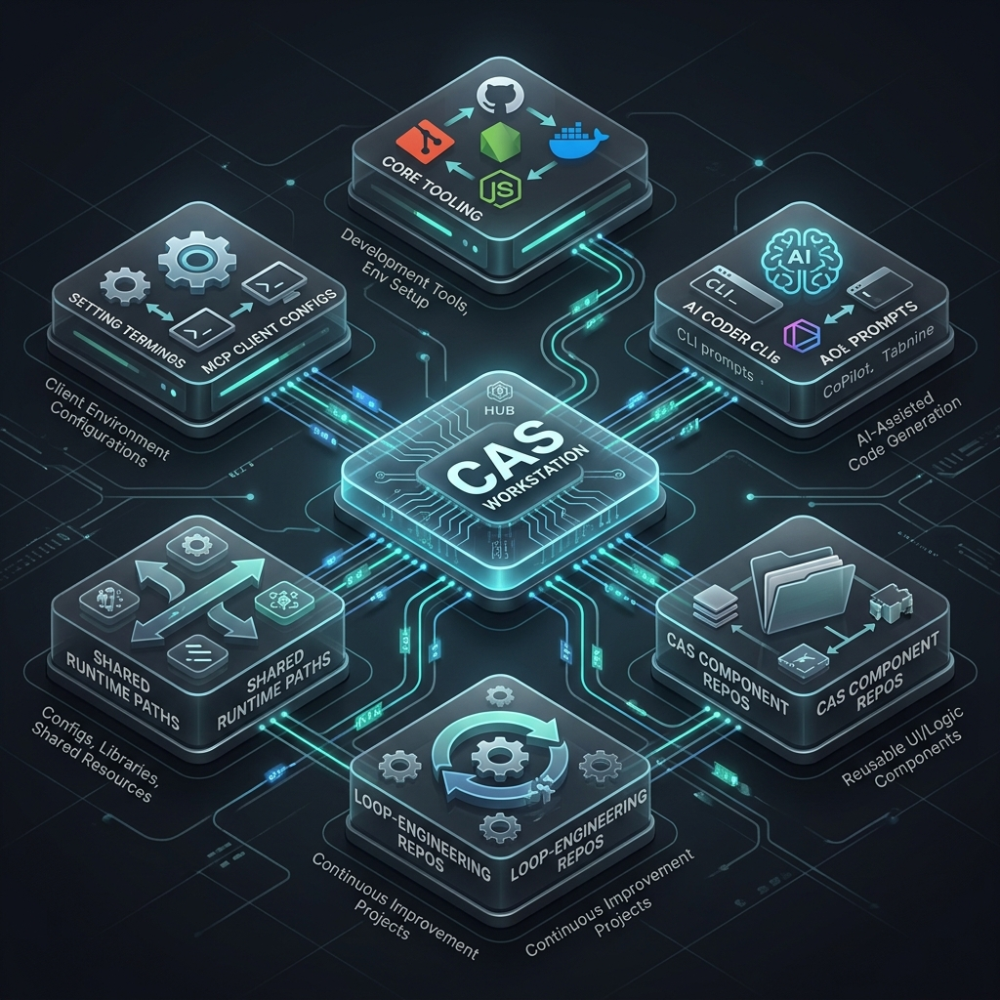

# CAS Workstation

CAS Workstation is the opinionated Windows-first bootstrap bundle for the
Coding-Autopilot-System ecosystem. It provides one install surface for a fully
configured AI-native coding workstation.

Public documentation for this repo now lives under `docs/` and is publishable
through GitHub Pages via the root `mkdocs.yml` and `.github/workflows/pages.yml`
pipeline.

## Commands

```powershell
.\cas.ps1 setup
.\cas.ps1 doctor
.\cas.ps1 start
.\cas.ps1 upgrade
.\cas.ps1 uninstall
```

## What It Manages



- Core developer tooling: Git, GitHub CLI, Node.js, Python, uv, .NET, Docker,
  Azure CLI, WSL
- AI coder CLIs: Codex, Claude Code, Gemini CLI
- Coding-Autopilot-System component repos
- Loop-engineering repositories under `C:\PersonalRepo\portfolio\`
- Shared runtime paths under `C:\PersonalRepo\.cas\`
- Generated MCP client configuration fragments

## Files

- `stack.manifest.json` - versioned workstation contract
- `schemas/doctor.schema.json` - machine-readable readiness report schema
- `scripts/Cas.Workstation.psm1` - shared implementation module
- `docs/support-matrix.md` - supported platform and component matrix

## Typical Flow

```powershell
.\cas.ps1 setup -NonInteractive
.\cas.ps1 doctor
.\cas.ps1 start
```
