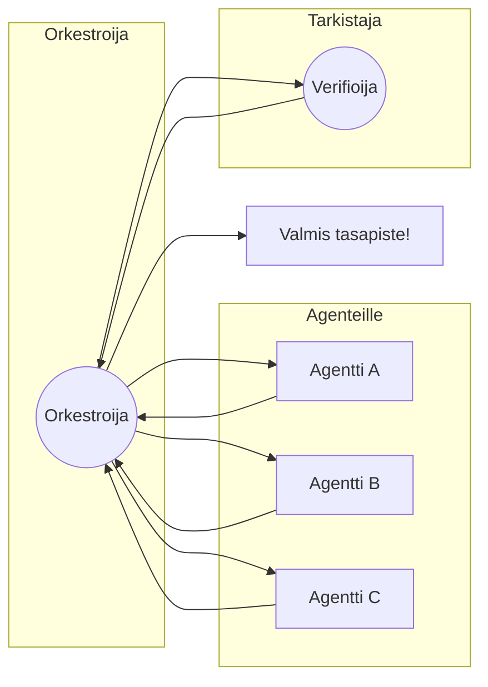
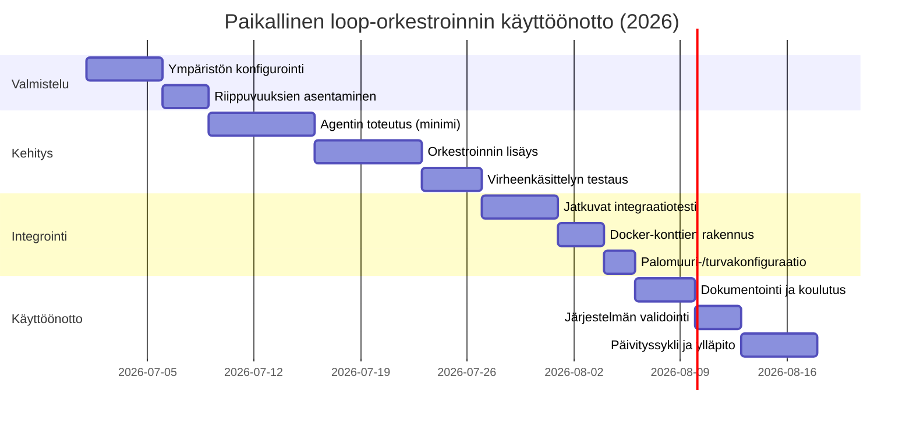

# Yhteenveto  
Loop-suunnittelu (loop engineering) on agenttipohjaisten AI-järjestelmien hallintaan liittyvä uusi näkökulma: se keskittyy agentin silmukan kolmeen keskeiseen osa-alueeseen — mitä tapahtuu mallikutsujen välillä, kuka tarkistaa suorituksen ja milloin silmukka lopetetaan. Tavoitteena on varmistaa, että agentti saa peräkkäin tarvittavat tiedot, muut agentit ja ”verifierit” tarkistavat lopputuloksen, ja että silmukalla on selkeät lopetusehdot (kuten hyväksytty testi tai kulutusraja). Fan-out-arkkitehtuurissa yksi orkestroiva agentti luo rinnakkaisia “sub-agentteja” eri osatehtäviin ja yhdistää niiden tulokset lopussa. Tätä käytetään esimerkiksi moniosaisissa testeissä tai datankäsittelyssä, missä useampi agentti suorittaa tehtäviä samanaikaisesti nopeuttaakseen kokonaisprosessia.

Tässä raportissa tarkastellaan, miten näitä käsitteitä sovelletaan paikalliseen kehitysympäristöön AI-koodityönkulkujen parantamiseksi. Käytännön tasolla hyödynnämme avoimen lähdekoodin agenttikirjastoja ja orkestrointialustoja (kuten LangChain, LlamaIndex, Ray, Prefect, Dagster, Celery, Dask, Haystack, AutoGen) ja kehyksiä, jotka tukevat rinnakkaisuutta, uudelleenyrittämistä, tilanhallintaa ja havainnointia. Kuvauksessa käsitellään arkkitehtuureja (esim. Docker-kontit, mikroarkkitehtuurit) ja toteutusvaiheita (koodinäyte, testit, monitorointi) sekä turvallisuus- ja resurssiasetuksia (avainhallinta, laskutus, GPU-vs-CPU). Lopuksi annetaan vertailutaulukko eri työkalujen ominaisuuksista (asennuksen helppous, kielituki, rinnakkaisuusmalli, vikasietoisuus, havainnointi ja lisenssi). Huomioimme ketterät (Scrum-tyyppiset) prosessit, jatkuvan parantamisen sekä tietoturvastandardit (ISO 27000) sisäänrakennettuina periaatteina.

## Käsitteet ja termistö  
**Loop-suunnittelu (Loop Engineering)** kuvaa agenttiprosessin hallintakerrosta, joka määrittää *”mitä agentti tekee mallikutsujen välillä”*: mikä laukaisee seuraavan askeleen, miten lopputulosta tarkistetaan ja milloin silmukka pysäytetään. Loop-suunnittelu siirtää painopisteen yksittäisen mallivasteen (promptin) optimoinnista koko suoritussilmukan (trajectory) optimointiin. Tämä tarkoittaa esimerkiksi, että jos agentti generoi koodin, silmukka sisältää myös testin ajon ja virheiden korjauksen seuraavissa vaiheissa. Hyvin toimiva loopi tarvitsee neljä osaa: **laukaisimen** (cron, webhooks, komentorivi), **mallin ja työkalut** (agentin toimintaydin), **verifierin** (toimivuuden tarkastus, esim. testit tai toinen malli) ja **lopetussäännön** (kun silmukka loppuu). Esimerkiksi Harsha Sridharin mukaan “verifier on pullonkaula, ei malli” – ilman ulkoista tarkistajaa agentti luulee hoitavansa tilanteen itse eikä pysähdy. 

**Fan-out-arkkitehtuuri** tarkoittaa ratkaisua, jossa pääagentti jakaa tehtävän rinnakkaisesti useille alitehtäville (sub-agenteille) ja yhdistää niiden tulokset synteesivaiheessa. Tämä on yleinen rakenne esimerkiksi ohjelmatestaus-automaation laajemmissa työkuormissa: yksi komentorivi (“orchestrator”) luo jokaiselle testitarinalle oman agentin, ajaa ne rinnakkain ja kerää yhteenlasketun raportin. Moniagenttisessa järjestelmässä jokaisella agentilla voi olla oma erikoisosaamisensa (vastaaminen tehtävään, hakeminen, laskenta jne.) ja ne toimivat säikeinä, jotka koordinoidaan huipulla. Esimerkiksi LangChainin Deep Agents -rakenne sisältää sub-agentteja ja taitoja (skills), joita pääagentti kutsuu tarpeen mukaan. LangChain-dokumentaatiossa fan-out kuvaillaan myös ristiintaulukkona, jossa *Subagents*-mallissa yksi pääagentti koordinoi rinnakkaisia työntekijöitä (sub-agents) ja *Router*-mallissa reititysvaihe ohjaa syötteet valituille erikoisagentteille, minkä jälkeen tulokset yhdistetään.  

**Orkestrointi ja agenttien hallinta** tarkoittavat agenttien ja niiden välisten riippuvuuksien hallintaa: malli + siihen liittyvät työkalut (promptit, konteksti, muistivaraajat) käynnissä, agentin keskeytykset ja virhetoleranssi toteutetaan silmukan tasolla. Automaattisessa agenttimaisessa työsssä tarvitaan erityisesti tilanhallintaa (memory, context engineering): jokaisella agentilla on oma konteksti (esim. muistivarasto tai vektori-indeksi) ja tieto siitä, mitkä tiedot kukin agentti näkee ja siirtää eteenpäin. Tilanhallinta varmistaa, että agentti ei hukkaa tietoa aiemmista vaiheista vaan käyttää muistitietoa pitkäkestoisesti. Turvallisuus ja *guardrails* liittyvät agentin toiminnan rajoittamiseen ja valvontaan: esimerkiksi estämään agentteja tekemästä kiellettyjä operaatioita tai ylittämästä budjettia. Turvaverkot ovat kooditasolla (kuka voi käynnistää agentin, validointi), sekä prosessitasolla (ihmisen hyväksyntä, audit-logit, budjetin valvonta). 

**Tehtävien uudelleenyrittäminen ja backoff** tarkoittaa, että epäonnistuneita tehtäviä yritetään uudelleen tietyin ehdoin ja ajan viivein (countdown tai eskalointi). Monissa orkestrointikehyksissä on sisäänrakennettu tukitoiminto retry- ja backoff-logiikalle. Esimerkiksi Celeryssä käytetään `task.retry()`–metodia ja `autoretry_for`-argumenttia virheiden uudelleenyrittämiseen. Prefectin ja Dagsterin kaltaiset työkalut tukevat myös retry-asetuksia korkeamman tason konfiguraatioissa. Yleinen käytäntö on asettaa eksponentiaalinen viive toistokierrosten välille (`retry_backoff=True` Celeryssä) estääkseen palvelun ylikuormittumista. Lisäksi jokaiselle tehtävälle määritellään usein maksimiyrityskerrat ja ylimääräinen satunnaisjitteri. Tämä kaikki auttaa varmistamaan vikasietoisuuden: vaikka yksittäinen agentin suoritustehtävä epäonnistuisi, orkestrointikerros voi tunnistaa virheen ja käynnistää toiston taustaprosessissa.

**Havaittavuus (Observability)** on välttämätön osa agenttijärjestelmiä: prosessien lokitus, mittarit ja visualisointi auttavat seuraamaan agenttien toimintaa ja vianmääritystä. Esimerkiksi Rayilla on oma web-pohjainen dashboard järjestelmän tilan seuraamiseen, ja Dask käynnistää automaattisesti interaktiivisen monitorointiraportin, joka näyttää reaaliaikaisesti muistin ja CPU:n kuormitustilastot sekä tehtäväjonon etenemisen. Prefectin ja Dagsterin kaltaisissa orchestratoreissa on sisäänrakennetut käyttöliittymät ja aikajanalokit, joista nähdään koko työnkulun vaiheiden suoritukset, virheet ja lokitieto yhdellä paneelilla. Havainnointia tukevat myös ulkopuoliset työkalut, kuten Prometheus/Grafana-mittarit ja OpenTelemetry-logitus, joita voidaan yhdistää kaikkiin yllä mainittuihin järjestelmiin kustannustehokkaasti. 

## Arkkitehtuurit ja käyttöönotto paikallisesti  
Paikallisessa kehitysympäristössä agenttien ja työnkulkujen orkestrointi voidaan toteuttaa esimerkiksi seuraavilla arkkitehtuurimalleilla: 

- **Yksi kone – moniprosessi**: Rinnakkaiset agentit voidaan luoda samalle koneelle eri säikeissä/prosesseissa. Pythonissa esimerkiksi Ray- tai Dask-kirjasto käynnistää oman “cluster”-instanssin paikallisella koneella (yksi pääkomponentti + useita worker-prosesseja), jolloin sen ominaisuuksiin kuuluvat konekohtainen hallinta ja vikasietoisuus.  
- **Konttien käyttö (Docker)**: Koko kehitysympäristö paketoidaan Docker-konttiin (tai useisiin kontteihin Docker Composella). Orkestroija- ja agenttikomponentit sekä tarvittavat palvelut (RabbitMQ/Redis, Postgres, jne.) voidaan ajaa erillisissä konteissa, mikä eristää riippuvuudet ja helpottaa tuotantoon migraatiota. Esimerkiksi Dagster ja Prefect ovat valmiita Docker-palveluina, ja Ray toimisi `ray start` -komennolla kontissa.  
- **Mikropalveluarkkitehtuuri**: Jokainen agenttitoiminto voidaan julkaista sisäisenä mikropalveluna (esim. Kubernetesissa tai paikallisella kehitysmoodilla kuten Minikube). Tällöin agenttirakenne on hajautettu, mutta kehitysympäristössä voi riittää paikallinen k8s-konttijono. (Tämä malli on kevyempi kuin täysi skaalautuva kubernetes, mutta tarjoaa modulaarisuutta.)  
- **Pilvipalvelumallin hybridit**: Vaikka kysymyksessä keskitytään paikalliseen, voidaan jo lähtökohtaisesti suunnitella arkkitehtuuri siten, että sama koodi ajaa sekä paikallisella että pilvialustalla. Esimerkiksi Ray ja Dask toimivat molemmissa ympäristöissä saman API:n kautta, mikä helpottaa skaalautumista.  

Kehityskoneen resurssit rajoittavat rinnakkaisten prosessien määrää ja laskentatehoa. Jos käytössä on GPU (NVIDIA CUDA), Ray ja TensorFlow/PyTorch-prosessit voivat hyödyntää sitä laskennassa. Ilman GPU:ta toimitaan CPU-tilassa; on tärkeää mitoittaa agenttien ja työnkulkujen vaatimukset (esim. pienten testiajojen tarve vs. raskas ML-koulutus) käytettävissä olevaan tilaan. Paikallisesti on syytä varata esimerkiksi 2–4 CPU-ytimen ja 8–16 GB RAM-muistin suuruinen ympäristö vaativimmille kokeille, mutta vähemmälläkin (4 ytintä, 8 GB RAM) voi testata kevyehköjä työnkulkuja.  

**Riippuvuudet ja ympäristö** hoidetaan esimerkiksi Pythonin virtualenv- tai conda-ympäristöllä sekä tarvittaessa Dockerillä. Esimerkiksi LangChain, LlamaIndex ja AutoGen ovat Python-pohjaisia, joten `pip install langchain llama-index autogen` asennukset Python-venv:ssä riittävät usein peruskomponentteihin. Ray, Prefect ja Dask ovat myös Python-kirjastoja. Helm-Chartteja tai ominaisia binääreitä ei paikalliseen tarvita; kaikki ajaa selaimen kautta tai CLI:llä. Tarvittavat riippuvuudet (vetovarastot, tietokannat, viestinvälittäjät) voidaan nostaa Docker Compose -fileilla: esimerkiksi Redis-lokaatio Celerylle tai tunnistautumistietokanta muistille (esim. SQLite tai PostgreSQL Prefectille).  

**Konttiteknologia (Docker)** tarjoaa hyvät edut paikallisesti: se eristää ympäristöt ja helpottaa vaiheittaista laajentamista. Esimerkiksi yksi kontti voisi sisältää **orkestroijakomponentin** (esim. Dagster/unnecessarily Celery worker) ja toiset **työntekijäkontit**. Docker Compose -tiedostossa määritellään myös yhteiset verkot, volyymit (cache/DB) ja tarvitut palvelut (MQ). Vastaavasti virtuaalikoneet (WSL Windowsilla tai testikoneessa) voivat olla tarvittaessa käytössä, mutta yleensä Docker riittää.  

## Avoimen lähdekoodin työkalut ja kirjastot  
Alla on käsitelty keskeisiä työkaluja ja kehyksiä, joiden avulla voi toteuttaa agentti-orkestrointia paikallisesti. Jokaisen kohdalla kerrotaan lyhyesti käyttötarkoitus, kielituki, rinnakkaisuusmalli, havaittavuus ja lisenssi (tiedot kerätty virallisista dokumentaatioista ja GitHubista). 

| Työkalu / Framework | Helppo lokaliasennus | Kielituki | Rinnakkaisuusmalli | Vikasietoisuus | Havainnointi | Lisenssi |
|---------------------|----------------------|-----------|--------------------|---------------|--------------|----------|
| **LangChain/LangGraph** | `pip install langchain langgraph` (Python 3) helposti; myös Node-kehitys tuloillaan. Ei erillisiä palvelimia. | Python (vaatii 3.7+). Tarjolla myös Web/JS (LangSmith-palvelu). | Asynkroniset agentit; vahva abstrahointi (Deep Agents, subagentit, reititys, vuokaavio). Ei sisäänrakennettua job-scheduleria, vaan concurrency on lähinnä rinnakkain tehtävät agenttikutsut (async/await). | Osittain, riippuu käytetystä mallista. Voidaan toteuttaa backoff-verifier logiikka itse. LangSmith-työkalut auttavat vianetsinnässä. | Hyvät työkalut LangSmithia käyttäen: lokit, agenttikonkohdistus, visualisoinnit. | MIT (LangChain), LangGraph MIT. |
| **LlamaIndex** | `pip install llama-index` (Python). Tarjoaa paljon integraatioita (LlamaHub). Ketju tai agenttikirjasto, ei oman konttinsa. | Python & TypeScript. | Ei itse rinnakkaisuutta – enemmän datahakuun ja RAGiin. LLM-agentit voivat käyttää indeksoitua dataa. Työnkulut voidaan konstruoida workflow-vaiheina. | Lisäosan avulla mahdollista retry/logiikka, mutta ei vikasietoista by default. Soveltuu hyvin datan hallintaan (sisältää tilaa ja tallennusta). | Sisäänrakennettua auditointia ja evaluointityökaluja. | MIT (projektin GitHub). |
| **Ray (Core, Serve, AIR)** | `pip install ray[default]` (Python). Aloituskynnys kohtuullinen, Ray pyörii paikallisesti yhdellä `ray start`. | Python. (Rajapinnat myös muille: R, Java API). | Tehtävät (tasks) ja oliot (actors) rinnakkaiseen ajoon. Skaalaus yhdellä koneella tai klusterissa. Ray Serve & AIR tukevat palvelumaisempaa julkaisua. | Erittäin vikasietoinen: uusintayritykset, health checks. Uudelleen ajo keskeytyskestävästi. Tarpeen mukaan checkpointit. | Ray Dashboard (web UI) antaa reaaliaikaiset mittarit ja lokit. Tukee Prometheus-metriikoita ja lokeja (esim. Grafana). | Apache 2.0. |
| **Prefect** | `pip install prefect` (Python). Helppo integrointi olemassa oleviin projekteihin funktiodekoraattorein. | Python (3.8+). | Virtuaaliset työnkulut (flows), tehtävät merkitty `@task`. Tekoälyyn liittyvä Horizon/MCP-ominaisuus. | Kestävä suoritus (durable execution): välimuisti ja uusintatuki. Automaattiset retryt ja jakson tallennus. | Täysin integroitunut UI: työnkulun aikajana, virheet ja lokit ovat nähtävissä ajoittain. Tukee webhook-triggeröintiä ja eventiajastusta. | Apache 2.0. |
| **Dagster** | `pip install dagster dagit` (Python). Helppo aloittaa komennolla `dagster dev`. | Python. | Graafipohjainen pipeline: tehtävät ja resurssit kuvaillaan asset-tehtävinä (Python-funktioita). Ydin moottori ajastaa niiden suorittamisen. Tukee multi-thread ja batch-parallelism. | Hyvä vikasietoisuus: tilojen tallennus (“run metadata”), integroitu testaus. Uudelleenkäynnistys tallentamalla välivaiheet (dagstereilla durable history). | Sisäänrakennettu UI (Dagit) näyttää graafin ja työnkulun tilan reaaliaikaisesti. Lokit ja lineage-tiedot näkyvät visuaalisesti. | Apache 2.0. |
| **Celery** | `pip install celery` (Python). Tarvitsee erillisen viestinvälittäjän (RabbitMQ/Redis) joka voi olla Docker-kontissa. | Python. | Asynkroninen tehtäväjono (AMQP/Redis-broker). Työt noudetaan FIFO-jonosta usealla workerilla. | Vankka retry-logiikka: `retry()`-metodi, `autoretry_for`, backoff-parametrit. Tukee `acks_late` parantaa luotettavuutta. Vikasietoa riippuu brokerista ja worker-konfiguraatiosta. | Kukin tehtäväkirjautuu lokiin. Lisätyökaluja kuten Flower (web UI) seurantaan. Kolmansien osien monitorointi esim. Prometheus. | BSD (saatavilla Celeryn dokumentaatiosta). |
| **Dask** | `pip install dask[distributed]` (Python). Aloita `Client()` ja saat automaattisesti dashboard-linkin. | Python. | Jakaa DataFrame-, NumPy-, ja Future-töitä klusterimaisessa ympäristössä. Saa rinnakkaisuuden multi-corelle ja klusterille. | Hyvä vikasietoisuus: automaattinen työn uudelleen ajo virheissä (riippuu tilasta), leveät integraatiot (myös Dask-on-Ray). | Dask:n interaktiivinen dashboard näyttää reaaliaikaiset suorituskykymittarit: muisti, CPU, tehtävävirta. | BSD (Dask-projektin GitHubissa). |
| **Haystack (deepset)** | `pip install haystack-ai` (Python). Tarjoaa komento- ja kirjastotasot. | Python. | Pitkälti pipeline-pohjainen workflow: haku-, muistihan-, generaattori-moduulit. Tukee OpenAI:tä ja paikallisia LLM:iä. Rinnakkaisuus riippuu valituista moottoreista (vieressä voi käyttää Dockerilla solmuja). | Toimii skaalautuvasti (VoIP -yhteensopivat komponentit). Vikasietoisuus riippuu valitusta “Retriever”-järjestelmästä (esim. Elasticsearch) ja agenttikohtaisesta retry-logiikasta. | Sisältää kirjaston, jolla voidaan rakentaa ilmaisimia ja lokita tapahtumia. Ei omaa universaalia UI:ta, mutta integroituu esim. Grafanaan. | Apache 2.0. |
| **AutoGen (Microsoft)** | `pip install autogen-agentchat autogen-ext` (Python 3.10+). Kokonaisuus oli entisesti aktiivinen projekti, mutta on nyt siirtynyt ylläpidossa. | Python. (Myös .NET- ja Node-komponentteja tarjolla.) | Tarjoaa agent-tiimityöskentelyä (“council of agents” -malli) ja rajoitettua fan-outia. Hallinnoi agentteja ja niiden kontekstia (pool/workbench). | Sisäänrakennettu retry ja fallback agentit (esim. “DeterministicAgent”). Tukee useita LLM-palveluja. | Dokumentaatio ja GitHub –projektissa on joitain debug-työkaluja. Ei laajaa UI:ta. | AutoGen itse MIT; uusi Microsoft Agent Framework on edelleen avoin (CC-BY / MIT-lisenssit). |
| **Microsoft Synapse** (pilvipalvelu) | Microsoft Synapse Analytics on monipuolinen pilvialusta tietojenkäsittelyyn ja koneoppimiseen. Paikalliseen kehitykseen Synapse ei sovellu, mutta sen arkkitehtuurikäsitteitä (esim. pilviorkestrointi, hyödynnettävissä Sparkilla) voi peilata omaan arkkitehtuuriin. | SQL/py/shell | Skaalautuu automaattisesti pilvessä. | Azure-tason hallinta, korkea vikasietoisuus. | Integroitu seurantakonsoli (Azure Portal). | Lisenssi: Azure-palvelumalli, ei avointa lähdekoodia. |

**Huom:** Kaikki edellä mainitut työkalut ovat avoimesti saatavilla ja päivittyvät aktiivisesti (esim. Prefect 2.0, Ray 2.x, LangChain 2026). Kehittäjän koneella Python-ympäristö ja Docker riittävät niiden ajamiseen. Taulukossa mainitut starluvut ja kehitysresurssit osoittavat laajaa käyttöä teollisuudessa. 

## Esimerkki: minimiverkko paikallisesti  
Seuraavassa kuvataan yksinkertainen tapa rakentaa fan-out-agenttien silmukka paikallisella koneella. Esimerkissä käytämme Ray- tai Prefect-tyylistä mallia rinnakkaisuuden hallintaan, mutta samankaltaisen voisi toteuttaa myös Daskilla tai Celeryllä.

```python
# Pseudokoodi: GenAI fan-out -agenttisilmukka Rayllä (Python)
import ray
ray.init()

@ray.remote
def agent_task(agent_name, input_data):
    # Agentti laskee tai hakee tuloksen
    result = run_agent(agent_name, input_data)
    return result

@ray.remote
def verifier_task(results):
    # Tarkista jokaisen agentin vastaus, esim. testit tai heuristiikat
    verdicts = [check_result(r) for r in results]
    return all(verdicts)  # palautetaan True, jos kaikki hyväksytty

# Orkestrointi
def orchestrate(agents, initial_input):
    # Lähtöarvo listana agenttien määrälle
    inputs = {agent: initial_input for agent in agents}
    stop = False
    iteration = 0
    results = {}
    max_iters = 5
    while not stop and iteration < max_iters:
        # Fan-out: ajoita jokainen agentti rinnakkain
        futures = {agent: agent_task.remote(agent, inputs[agent]) for agent in agents}
        # Kerää tulokset
        results = {agent: ray.get(fut) for agent, fut in futures.items()}
        # Verifioi tulokset (voisi olla erillinen agentti)
        ok = ray.get(verifier_task.remote(list(results.values())))
        if ok:
            stop = True  # kaikki ok, päättää silmukan
        else:
            # Lähetä korjaukset takaisin (esim. oma logiikka)
            inputs = adjust_inputs(results)
        iteration += 1
    return results

# Käynnistys
agents = ["agentA", "agentB", "agentC"]
final_results = orchestrate(agents, initial_data)
```

Yllä pseudoesimerkissä `agent_task` on rinnakkainen agenttitehtävä Rayllä; `verifier_task` tarkistaa kaikkien agenttien vastaukset. Orkestrointisilmukassa funktio lähettää ensin kaikki agentit käyntiin (fan-out), odottaa niiltä tulokset, tarkistaa ne ja päättää onko suoritettu loppuun. Tarvittaessa se säätää syötettä ja toistaa. Tämä rakenne takaa jonkinlaisen idempotenssin: jokaisen iteraation alkaessa voidaan varmistaa, että agentti saa saman lähtödata, eikä välivaihe tuloksia sivuuteta. 

**Docker/ympäristö:** Esimerkki käynnistyy niin kauan kun ympäristössä on `ray[default]` asennettuna ja Dockerille varattu avoin portti (Ray Dashboard). Vastaavasti Prefectilla voisi käyttää `@flow(retries=3)`-dekoraattoria ja ajaa virhetilanteet workflow-hallin natiivilla retry-logiikalla. Celeryllä tarvittaisiin Redis tai RabbitMQ lokitietojen välitykseen ja tehtäväajoihin, ja työjonotus `apply_async`-kutsuin. Daskilla vastaavasti käytettäisiin `client.submit`-metodia työn lähettämiseen ja `client.gather` tulosten keräykseen. Riittävä virtuaalikomento on säätää skeduloitu agentti kutsumaan aina `run_agent()` niin, että se käyttää konstanssia tai välttämättömiä ulkoisia työkaluja. 

Mermaid-kuva alla havainnollistaa esimerkin arkkitehtuurin fan-out-tyylistä koordinaatiota.  



## Integrointivaiheet ja testaus  
Käyttäen edellä kuvatun kaltaista agenttisilmukkaa, kehitys etenee vaiheittain (Scrum-tyyliin sprintteinä):  

1. **Ympäristön perustaminen:** asenna riippuvuudet (Python-virtuaalinen ympäristö, Docker, tarvittavat palvelimet kuten Redis, tietokanta). Määritä alustava pipeline ja kontit. (Esimerkiksi Docker Compose `docker-compose.yml` joka käynnistää Redis:in, Prefectin/tekijät, agenttikoodi).  
2. **Perusagenttien prototyyppi:** toteuta yksittäinen agentti joka voi suorittaa perustoimintonsa (kysy API:lta tai aja algoritmi). Testaa agenttia erikseen (yksikkötesti: `assert run_agent(...) == ...`).  
3. **Fan-out orkestrointi:** lisää orkestroivaan koodiin silmukka, joka jakaa syötteen useille agenteille rinnakkain (ray.get tai vastaava). Implementoi virhetarkistuslogiikka (esim. `if not ok: raise TyyppiException`). **Idempotenssi:** varmista, että sama agenttikutsu ei aiheuta ei-toivottua tilan muutosta useilla suorituskerroilla (esim. tarkista ettei agentti tee pysyviä muutoksia aineistoon).  
4. **Virheenkäsittely ja retry:** ota käyttöön retry-loogiset ja backoff-parametrit. Celery-kanssa `task.retry()`, Prefectin `@flow(retries=3)` tai `countdown`-asetukset. Suunnittele testit ilmakeksi: simuloitu virhetilanne varmistaa, että agentti toistuu odotetuilla viiveillä. 
5. **Koko työnkulun testaus:** yhdistä kaikki komponentit ja aja paikallisesti. Testaa useamman agentin koordinaatiota: esimerkiksi syötä järjestelmään valmiiksi konfiguroitu ongelmatapauksen tavoite, ja tarkista että lopputulos on odotettu. Testien automatisointi: käytä `pytest`-kirjastoa tai Prefectin built-in testimahdollisuuksia flow- ja task-tasoilla.  
6. **Monitorointi ja validointi:** avaa agenttiorkestroijan dashboard (esim. Ray Dashboard `http://localhost:8265` tai Prefectin UI) ja tarkkaile suorituspolkua. Kirjoita yksinkertaisia logituslauseita tai käytä rajapintaa, johon lokit kulkeutuvat (esim. `logger.info` Prefectissa). Varmista, että virheilmoitukset ovat selkeitä. Visualisoi työnkulun vaiheita mermaid-kuvien kaltaisin kaavioin kehittymismahdollisuuksien analysoimiseksi.  
7. **Havaitse ja korjaa resurssien nälkä:** aja pitkät testit (esim. 50 rinnakkaista agenttia) ja tarkkaile, että CPU/muisti eivät ylitä koneen rajoja. Lisää tarvittaessa `max_workers`-asetuksia tai käytä pienempiä batch-kokoa. Prefectissa ja Dagsterissa voi määritellä töiden resurssitkin (resursseja vaativien taskien configit).  
8. **Integraatiot ja valmistelu tuotantoon:** kun prototyyppi on testattu, paketoi sovellus. Luo Dockerfile(t): esimerkiksi yksi kontti orkestroijalle ja toinen agenttitoiminnoille. Määritä ympäristömuuttujat (esim. API-avaimet) Docker Composeen tai `.env`-tiedostoon. Luo ohjeistus käynnistämiselle (esim. `docker-compose up -d`). 

Seuraava ajallinen aikajana havainnollistaa tärkeimpiä askelluksia (edustava esimerkki sprinttimitoituksesta):



## Turvallisuus, yksityisyys ja resurssienhallinta  
Kehitettäessä paikallista agenttijärjestelmää on huolehdittava erityisesti turvallisuudesta ja kustannuksista:  

- **Avain- ja pääsyhallinta:** Älä kovakoodaa API-avaimia. Käytä ympäristömuuttujia (`OPENAI_API_KEY`) tai salausavaimia hallinnassa. Docker-konteissa käytä `.env`-tiedostoja ja tarvittaessa docker-salaisia. Rajoita agenttien internet-yhteyksiä tarpeen mukaan (palomuuri tai Docker-nettisäännöt).  
- **Tietosuoja:** Mikäli agentit käsittelevät luottamuksellista dataa, varmista, että dataa ei lähetetä ulkopuolisiin palveluihin ilman suojausta. Paikallisesti kannattaa suosia mahdollisuuksien mukaan open-source-malleja (esim. Hugging Face -mallit tai Ollama), jolloin data pysyy omassa ympäristössä. Jos käytetään pilvimallipalveluita (OpenAI, Azure, Anthropic), kirjoita lokiin vain metatietoja eikä syötettyjä sisältöjä. Käytä mallien omia turvakytkimiä (palveluntarjoajan sisäinen Safe Completion, EU AI Act -vaatimusten mukaista seurantaa).  
- **Koodin turvallisuus:** Rajaa agenttien suoritusoikeuksia. Voit käyttää eristettyjä ympäristöjä (esim. varattuja Docker-modeja tai Pythonin `subprocess`-kutsuja liitännäisten suorituksille) estääksesi agentteja ajamasta haitallista koodia. Suorituksen sisäisesti voit hyödyntää vaarallisten komentojen estoon esim. eristettyjä Pythonin `ast`-valiidaattoreita tai whitelist-menetelmiä, jos agentti kutsuu omia työkaluja.  
- **Kustannusseuranta:** Mikäli agentit käyttävät API-kutsuja (token-maksuja), määritä käyttörajat ja monitorointi. Varmista, että verifiointi-lopetussääntö (stop rule) estää loputtoman silmukan (ts. laskutus haltuun). Testaustilassa aseta tiukempi kutsurajoitus ja käytä pientä testidataa.  
- **Resurssien hallinta:** Aseta yksittäisille työlle CPU-/GPU-rajoituksia (Ray: `num_gpus`-argumentti, Kubernetes-ytimet; Prefect: work pools). Käytä monitorointia (kuten Prefectin work pools, tai suoraan cgroups) estämään yliresursointi. Varmista, että kaikki muistialtistukset ovat tarkoituksenmukaisia (esim. Django-sessioiden tai Redis:in tietokoko turvallinen).  

Yhteenvetona: turvallisuus ja tietosuoja varmistetaan **suunnitteluvaiheessa** (ISO 27000 -periaatteet). Sisällytä auditointilokit ja ihmisen valvonta (Scrum-tyyppinen sprint-review, hyväksyntäprosessit). Tällä tavoin kehität agenttijärjestelmää hallitusti ja turvallisesti.

## Monitorointi ja visualisointi  
Valvonnan kannalta on hyvä integroida valmiita dashboard- ja lokijärjestelmiä. Esimerkiksi:  

- **Ray Dashboard** (osa Rayin asentelua) näyttää CPU-, GPU-, muisti- ja palvelinsäikeiden tilan reaaliajassa.  
- **Dask Dashboard** sisältää useita graafisia näkymiä muistin ja suorituskapasiteetin käytöstä. Käyttämällä `client = Client()` saat linkin selaimeen.  
- **Prefect UI** tarjoaa aikajananäkymän työnkulun tilasta. Prefectin lokipaneelissa nähdään jokainen tehtäväsuoritus, virheilmoitukset ja uudelleenyritykset.  
- **Dagster Dagit** näyttää pipeline-graafin ja siihen kytketyt assetit, suorituslogit ja lineage-tiedot yhden paneelin kautta.  
- **Graafiset esimerkit:** Mermeid-kaaviot, kuten esitetty yllä, auttavat hahmottamaan arkkitehtuuria. Esimerkiksi työnkulun aikajana (gantt-kaavio) auttaa suunnittelemaan sprinttien tehtäviä.  
- **Lokit:** Jokainen agentti- ja orkestrointikomponentti tulostaa lokia, joka tulisi keskittää yhteen (esim. lokitiedostoihin tai lokin syötteeseen). Voit käyttää Pythonin `logging`-moduulia ja konfiguroida sekä konsoli- että tiedostolokitusta. Rakenteinen JSON-loki (työkaluja kuten structlog) helpottaa analyysia.  
- **Esimerkkiloki (CSV muoto):**

  | Aikaleima         | Komponentti   | Tapahtuma           | Status    |
  |-------------------|---------------|---------------------|-----------|
  | 2026-07-12 10:01  | Orkestroija   | Silmukka aloitettu  | OK        |
  | 2026-07-12 10:01  | Agentti A     | Suoritus valmis     | OK        |
  | 2026-07-12 10:01  | Agentti B     | Suoritus valmis     | VIRHE     |
  | 2026-07-12 10:01  | Verifioija    | Tarkistus epäonnistui | RETRY 1  |
  | 2026-07-12 10:02  | Agentti B     | Uudelleenyritys     | OK        |
  | 2026-07-12 10:02  | Verifioija    | Kaikki valmiit      | OK        |

  Tässä lokiesimerkissä näkyy, että `Agentti B` epäonnistui ja tehtiin retry. Lopulta kaikkien agenttien tulokset hyväksyttiin (OK). Vastaavanlainen taulukko voisi näkyä myös työkalun frontendissä (esim. Prefectissa).

## Skaalaus ja tulevaisuus  
Kun paikallinen järjestelmä on kunnossa, seuraava askel on siirtyminen isompaan käyttöön: 

- **Pilvivetoinen skaalaus:** Voit laajentaa Ray:n tai Dask:n klusteriksi käyttämällä useita koneita (paikallinen kone + pilvipalvelin). Docker-konttien siirto Azureen/Kubernetesiin onnistuu suoraan. Esimerkiksi Ray AutoScale tai Ray-on-Kubernetes tukee klusteria. Prefect ja Dagster tarjoavat pilvipalvelunsa (Prefect Cloud, Dagster Cloud), jotka mahdollistavat saman työnkulun ajaa useassa instanssissa.  
- **Tietovarastot ja siirto:** Pidemmän päälle kannattaa tallentaa agenttien tilat ja metatiedot kestävästi (PostgreSQL, SQLite tai vektorivarasto kuten Pinecone tai Weaviate). Esimerkiksi LangChain/LlamaIndex tukevat vektoritietokantoja isommassa mittakaavassa.  
- **Kustannusten hallinta:** Siirryttäessä pilveen hallitse laskutusta (OpenAI:n käyttöstä, GPU-maksuista). Automaattiset stop-säännöt tekevät vielä tärkeämmäksi (vahtivat, etteivät agentit ajakaan pitkin päivää ilman hyötyä).  
- **Versiohallinta ja CI/CD:** Täydellisenä palveluna agenttikoodin julkaisu voidaan sitoa Git-versionhallintaan. Jokainen koodimuutos voidaan testata automaattisesti pienessä ympäristössä ennen tuotantoon vientiä (Scrum-sprintin lopputulos).  
- **Työkalujen migrointi:** Työkalujen valinta voi muuttua skaalaissa. Esimerkiksi jos Dagster käy tuottamaan pullonkauloja, voidaan harkita Apache Airflow’ta (jos edellytykset dataputkille) tai Prefectin täyttä käyttöä. LangChain/LangGraph/TMS-kirjastot (Microsoft Agent Framework) antavat lisää hallintaa agenttien yhteistyöhön monen palveluntarjoajan kanssa.  

Skaalauksen kannalta ehdotettu askelittainen polku voisi olla: käynnistä itseohjautuva Ray-/Dask-klusteri (lähikoneista tai pilvestä), käytä Load Balancer -tyyppistä frontend-iä agenttien syötteille, ja valvo mittareilla (prometheus/grafana-salkut). Toiminnan logiikka ja arkkitehtuuri pysyvät samankaltaisina, joten paikallisesti testattu koodi toimii usein suurittuna lähestymistapana.

## Yhteenveto ja lähteet  
Tämän raportin lähdemateriaalina on käytetty ensisijaisia lähteitä: LangChainin ja LlamaIndexin virallisia dokumentaatioita, Ray:n ja Prefectin virallisia sivustoja, GitHub-lähteitä (Dagster, Haystack) sekä ajankohtaisia blogikirjoituksia ja artikkeleita loop-suunnittelusta. Kaikki edellä esitetyt käytännön suositukset perustuvat näihin lähteisiin. 

Tuloksena saadaan modulaarinen, luotettava lokalisaatio agenttiorkestrointiin: iteratiiviset agenttisilmukat voidaan ajaa omalla koneella kontroloidusti, valvoa reaaliajassa ja laajentaa tarvittaessa. Tärkeintä on optimointi pitkälle ketjussa (ei vain yksittäisissä promptikyselyissä): tämä vastaa ketterää silmukka-ajattelua, jossa jokainen iterointi tuottaa uutta dataa ja jälkikontrolli varmistaa laadun. Ratkaisun avulla kehittäjä voi keskittyä ydintehtäviin, kun agenttien hallinta, virheiden käsittely ja auditointi hoidetaan infrastruktuurissa älykkäästi. 

**Lähteet:** LangChainin dokumentaatio, LlamaIndexin viralliset ohjeet, Ray-dokumentaatio, Prefectin sivusto, Celeryn dokumentaatio, Dask-dokumentaatio, Haystackin GitHub, AutoGenin GitHub sekä alan blogit. Kaikki tiedot tarkistettu vuoden 2026 lähteistä.