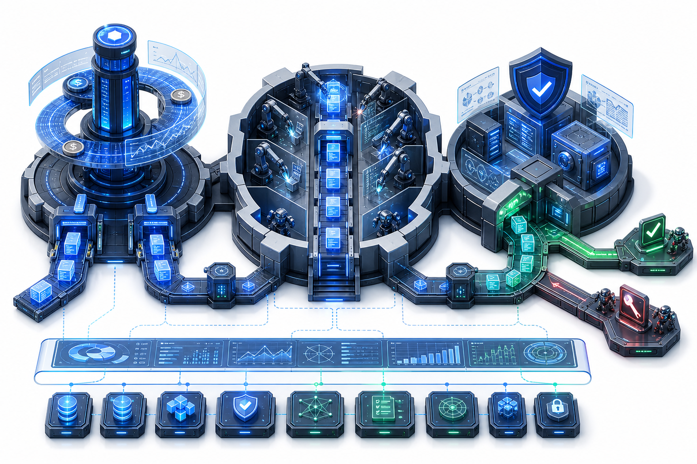
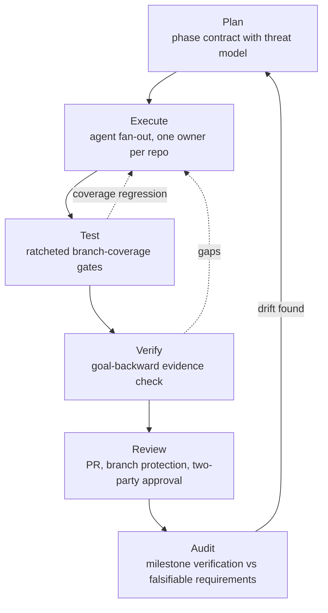
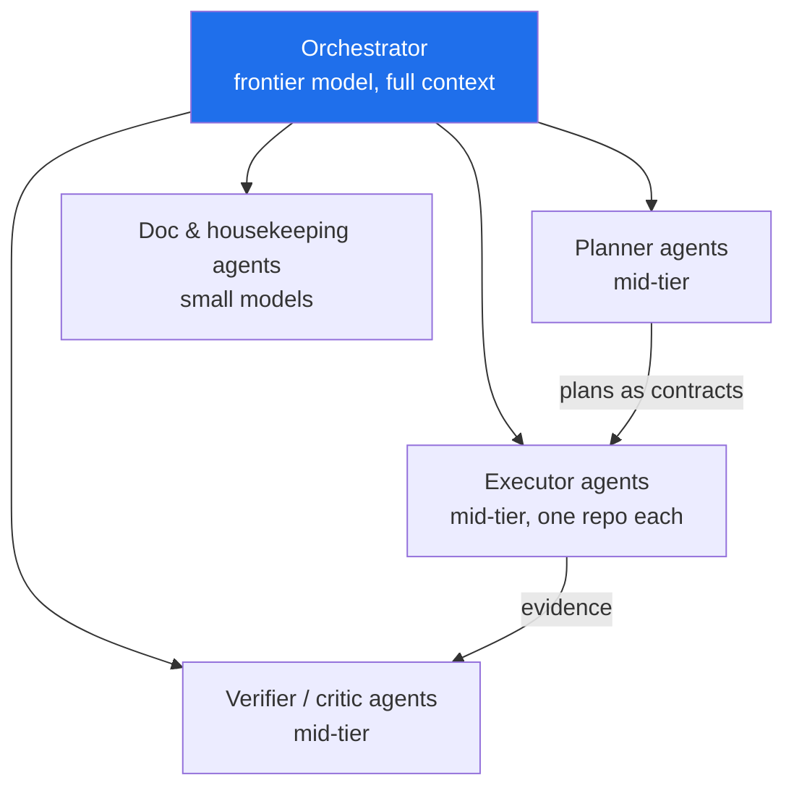

# CAS — Governed Autonomy for Software Delivery

> **Speed without governance creates risk. Governance without speed creates irrelevance.**
> CAS (Coding-Autopilot-System) is built on the position that this is a false trade-off: when governance is executable — schemas, gates, and evidence instead of meeting minutes — it *is* the speed.

<!-- codex:generate-image prompt="Hero banner: an assembly line where autonomous robot arms write code, and every station has a transparent glass quality gate stamping a green seal; isometric, enterprise blue/graphite palette, subtle circuit motifs, wide banner format" style="isometric, enterprise, clean" replaces="none" -->

## The problem

Every enterprise is discovering the same thing: AI agents can produce code far faster than humans can review it. The standard responses both fail —

- **Ship it** (speed without governance): untracked artifacts, untruthful commit messages, unreviewed merges, silent drift. We have measured versions of each of these failure classes in our own workspace — including a commit that *claimed* to add test suites while its diff contained none.
- **Board it** (governance without speed): review queues, manual sign-off, documentation that decays the day it's written. The agents idle; the advantage evaporates.

CAS is a working system — 13 production repositories plus a workstation control plane — that resolves the tension by making every governance control **machine-executable and evidence-producing**.

## The answer: governed autonomy

> The original machine-readable flow is preserved at
> [`docs/diagrams/governed-autonomy.mmd`](diagrams/governed-autonomy.mmd).

<!-- codex:generate-image prompt="Executive architecture infographic for governed AI software delivery: three large interlocking mechanisms representing Control, Execution, and Governance arranged left to right inside a clean enterprise system diagram. Control appears as a cobalt scheduling tower with timeline rings and admission gates. Execution appears as disciplined robot worker cells passing code artifacts along a luminous conveyor. Governance appears as a shielded verification complex with schema panels, evidence vaults, and a green decision gate that routes either to merge or bounded repair. Show artifacts flowing through the whole system with glass overlays, subtle telemetry lines, premium white presentation background, blue-graphite-teal palette, isometric perspective, crisp non-cartoon enterprise style, no text labels embedded in image." style="isometric, enterprise, premium infographic" replaces="mermaid-above" asset="docs/assets/governed-autonomy.png" -->

Three planes, strictly separated:

| Plane | Owner | What it enforces |
|---|---|---|
| **Control** | `gsd-orchestrator` | Goals are typed, measurable, bounded. Nothing runs without a budget and a stop rule. |
| **Execution** | `autogen` (MAF workers) | Every worker owns its mutation scope exclusively. Failures are *typed states*, never stack-trace soup. |
| **Governance** | `Promptimprover`, `cas-contracts`, `cas-evals` | Prompts, schemas, and verification are versioned artifacts. Completion requires deterministic evidence — an agent saying "done" is not evidence. |

## Every change runs the same SDLC loop

<!-- codex:generate-image prompt="Circular racetrack with six pit-stop stations labeled Plan, Execute, Test, Verify, Review, Audit; a sleek car made of code symbols racing through; each station has a gate barrier that only opens on green; isometric, enterprise" style="isometric, enterprise, clean" replaces="mermaid-above" -->

The loop is not aspirational — each gate is a running control with a falsifiable check:

- **Truthful history**: a commit-integrity check flags any `test:`-typed commit whose diff contains no test files (built after catching a real one).
- **Ratcheted coverage**: CI gates fail on branch-coverage regression and only ratchet upward with real tests — never a hardcoded aspirational 100%.
- **Typed failures**: a versioned `FailureState` schema in `cas-contracts`; orchestrator and workers map every boundary failure to it, proven by fault injection (process kills, corrupted checkpoints, simulated API outages).
- **Supply-chain pinning**: every third-party GitHub Action pinned to a commit SHA with least-privilege token scopes, verified by an org-wide lint that runs in CI.
- **Drift detection**: a daily workspace-health sweep runs 11 checks (unpushed work, orphaned artifacts, stale PRs, encoding hazards, broken worktrees) and exits non-zero on any finding.
- **Deploy lock as policy**: infrastructure is maintained "bicep-ready" — linted, parameterized, pinned — while an operator hard lock prevents any cloud deployment until it is deliberately lifted. Governance includes what you *don't* ship.

## Modular agents, priced to the task

<!-- codex:generate-image prompt="Organizational chart of robots: one large conductor robot on top with a baton, delegating to rows of medium specialist robots (blueprint, wrench, magnifying glass icons) and small clerk robots with clipboards; price tags shrink down the hierarchy; isometric, enterprise" style="isometric, enterprise, clean" replaces="mermaid-above" -->

The orchestrator delegates through **typed sub-agents** (planner, executor, verifier, critic, doc-writer), each with a scoped toolset and an explicitly chosen model tier — frontier reasoning only where it pays, small models for mechanical work. Specialist agents deliberately *cannot* spawn their own sub-agents; delegation depth is a governance decision, not an accident. The result: parallel throughput of a team, token cost of a task queue, and an audit trail for every decision.

## Proof points (v1.4 hardening milestone, one working week)

- 25-PR release train merged across 13 repos with branch protection never left disabled.
- 2 orphaned test suites recovered and gated; coverage baselines measured and ratcheted (branch coverage, not vanity line metrics).
- 37 + 16 new tests landed via fault injection and coverage phases; 134-test suites green.
- 4 stranded commits, 11 unmerged agent branches, and 14 broken worktrees detected and recovered — zero work lost.
- Every finding became a permanent automated check the same week it was found.

---

*This document lives at `docs/VISION.md` and in the org profile. Diagrams are Mermaid-first; `codex:generate-image` placeholders mark where generated visuals will replace them.*
<!-- docs-verified: 7c04d9e 2026-07-08 -->
