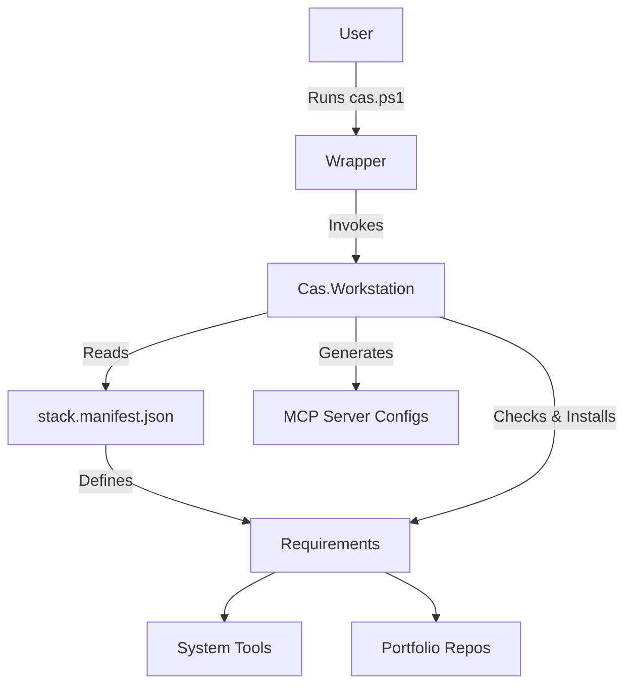

# CAS Workstation Architecture

The CAS (Coding-Autopilot-System) Workstation is an opinionated, desired-state environment bootstrapper. It relies on a manifest-driven approach to configure an AI-native developer machine.

## Components

1. **Manifest (`stack.manifest.json`)**: The core truth of the system. It defines tool dependencies (e.g., node, python, docker, git), GitHub repositories to clone into the `portfolio` folder, and specific configurations for AI agent integration.
2. **PowerShell Module (`Cas.Workstation.psm1`)**: Provides the imperative commands to read the manifest, perform capability checks (doctor), and execute setup or upgrade flows.
3. **CLI Wrapper (`cas.ps1`)**: The primary user interface to invoke the workstation commands (`setup`, `doctor`, `start`, `upgrade`, `uninstall`).
4. **Portfolio (`portfolio/`)**: A directory where all dependent repositories are cloned and kept up-to-date. Each repository represents an agent, MCP server, or core library within the CAS ecosystem.
5. **Runtime Config (`.cas/`)**: A dedicated configuration directory (typically `~/.cas`) where logs, state, and generated MCP configurations reside.

## Workflow

