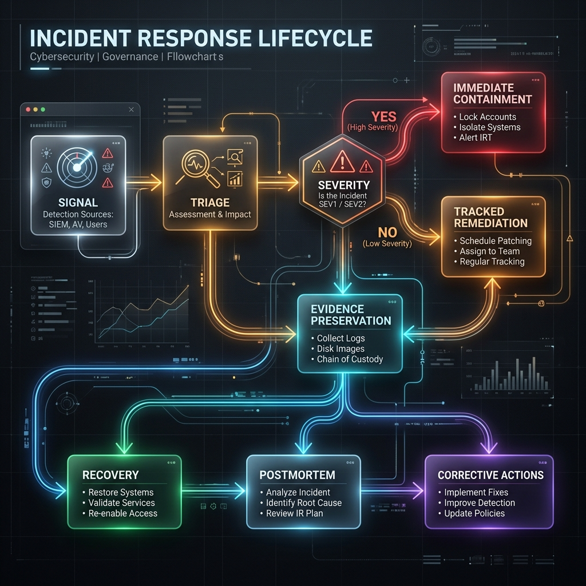

# Incident Standard

This is the portfolio-wide incident baseline for CAS repositories and operating
surfaces.

## Lifecycle

Prepare -> Detect -> Triage -> Contain -> Eradicate -> Recover -> Learn

## Severity model

| Severity | Description | Example |
|---|---|---|
| SEV1 | Portfolio-wide or regulatory-impacting event | Credential compromise across multiple repos or control systems |
| SEV2 | High-impact issue affecting one critical repo or release/control path | Release integrity failure in `cas-contracts` or `gsd-orchestrator` |
| SEV3 | Moderate impact with limited scope | Broken Pages deployment, workflow permission misconfiguration |
| SEV4 | Low impact or informational control issue | Documentation drift or non-exploitable config gap |

## Roles

- **Incident commander**: overall coordination and decisions
- **Technical resolver**: implements remediation
- **Evidence lead**: preserves logs, commits, workflow runs, and timelines
- **Communications lead**: stakeholder updates and external messaging when needed
- **Risk owner**: approves major containment or accepted residual risk

## Source of truth

- Portfolio baseline: `docs/incident-standard.md`
- Triage runbook: `portfolio/cloud-security-service-model/docs/20-runbooks/rbk-001-incident-triage.md`
- Incident report template: `portfolio/cloud-security-service-model/docs/21-templates/template-incident-report.md`
- Evidence ledger: `evidence/compliance/incident-management.csv`

## Minimum evidence

Every incident record should capture:

- severity and scope
- affected assets
- timeline of detection, triage, containment, and recovery
- related commit SHAs, workflow runs, deployments, and issue or PR references
- root cause
- corrective action
- residual risk and owner

## Escalation expectations

- SEV1/SEV2: immediate owner notification and same-day containment path
- SEV3: tracked remediation with explicit owner and target date
- SEV4: may route through standard backlog if no control weakness remains

## Post-incident loop

- Open an incident record the same day a material control or runtime failure is confirmed.
- Preserve the supporting evidence reference before attempting cleanup or reruns.
- Complete a postmortem within 5 business days for every SEV1 or SEV2 event and every control-integrity failure that blocks audit claims.
- Route corrective actions into `docs/risk-register.md`, `evidence/compliance/exception-register.csv`, or the relevant control ledger.

## Exercise cadence

- Run at least one incident tabletop or live-response drill every quarter.
- Keep the latest annual exercise trail in `evidence/compliance/incident-management.csv`.
- Treat a missing or stale exercise record as a portfolio control gap.

## Portfolio rule

If evidence for a control is missing, malformed, or integrity-failed, treat that
as an incident in the control system, not just a documentation gap.
