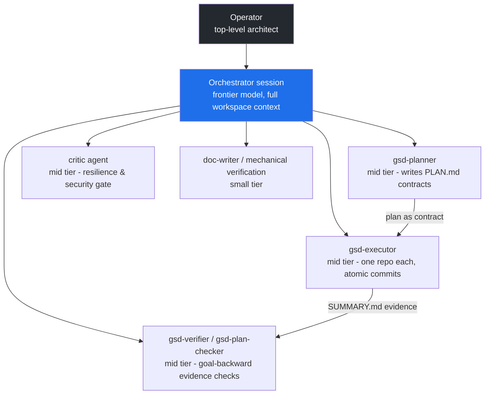

# CAS Agent Hierarchy — Modular Delegation with Model Tiering

How CAS structures its AI workforce: who can spawn whom, which model tier each role runs on, and why delegation depth is a governance decision rather than an accident.

<!-- codex:generate-image prompt="Corporate org chart of robots: human architect silhouette at top, one large blue conductor robot below, then a row of medium specialist robots (blueprint scroll, wrench, magnifying glass, shield), bottom row of small clerk robots with clipboards; each tier has a smaller price tag; clean isometric enterprise style" style="isometric, enterprise, clean" replaces="mermaid-above" -->

## Can an agent launch sub-agents?

**Yes — but only where the role definition allows it.** The rule set:

| Role | Toolset | Can spawn sub-agents? | Why |
|---|---|---|---|
| Orchestrator (main session) | full | Yes | It owns decomposition, wave scheduling, and repo-ownership locks (one executor per working tree). |
| `claude` / `general-purpose` | full (`*`) | Yes | Catch-all roles for genuinely open-ended work; nesting allowed because their scope is unbounded by design. |
| `gsd-debug-session-manager` | includes Agent | Yes (bounded) | Debug loops legitimately need to spawn specialist investigators. |
| `gsd-planner`, `gsd-executor`, `gsd-verifier`, `gsd-code-reviewer`, doc agents | scoped (Read/Write/Edit/Bash/Grep/Glob...) | **No — deliberately** | Specialists execute a contract; if the contract needs decomposition, that is the orchestrator's job. Keeps the delegation tree shallow, auditable, and immune to runaway recursive spawning. |

Every spawn leaves evidence: a prompt contract in, a `SUMMARY.md` (or report file) out, in `.planning/phases/<phase>/`. That is the audit trail for the AI workforce itself.

## Model tiering — pay for reasoning only where it compounds

| Tier | Used for | Examples from the v1.4 milestone |
|---|---|---|
| Frontier (orchestrator) | Decomposition, reconciliation across parallel sessions, judgment calls, constraint conflicts | Reconciling Gemini/Claude session overlap; NO-AZURE lock scope ruling |
| Opus (planning) | Complex multi-repo phase plans with threat models | Phase 26 coverage plan (found the broken line-rate gates), Phase 30 release train |
| Sonnet (execution) | Repo-scoped implementation, verification with judgment | ~25 executor/planner runs: coverage gates, bicep hardening, SHA pinning, wikis |
| Haiku (mechanical) | Deterministic checklists: run lint, tabulate, report | Phase 31-06 org-wide verification (13 repos, 33 tool calls) |

Selection defaults live in `engineering-os/models/claude.json`; any spawn can override per task. The heuristic: **if the task's failure mode is "wrong judgment", go up a tier; if it's "typo", go down.**

## Concurrency rules that make the fan-out safe

1. **One agent per git working tree** at any moment (branch switching is process-global) — enforced by the orchestrator's dispatch queue; agents needing a busy repo use detached worktrees with Windows-native paths.
2. **PR-only for sub-repos; the agent never self-approves or merges** — two-party review is enforced by the permission layer even under autonomous goals (verified live: the classifier denied self-approval and the denial was treated as a hard boundary).
3. **Foreign dirty files are untouchable** — parallel operator sessions (Gemini, Codex) may leave work in progress; executors stage only files their plan names.
4. **Session caps are survivable** — plans and summaries on disk mean any interrupted agent's work is reconciled from artifacts, not memory.

<!-- docs-verified: pending-phase-36-verifier 2026-07-08 -->
